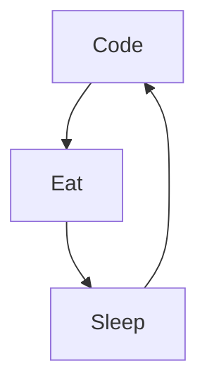

### Hi there 👋
### 👩🏼‍💻 I'm Ophélie and I'm a french web developer. I really enjoy learning languages and frameworks like PHP and Symfony. 

*****************

- 🔭 I’m currently working on : a private (for the moment) project
 - 🌱 I’m currently learning **Symfony, Javascript, Docker, REACT
- 💬 Ask me about **Symfony**
- 
- ### Connect with me:
- 📫 How to reach me **contactjuliettevila@gmail.com**

*****************
## 🪄 Technologies, Languages, Tools and Environments :

- 
     

-    !

-    

-   

### My daily routine :

### 💻 OS :  
 

<!--
**Ophelie22/Ophelie22** is a ✨ _special_ ✨ repository because its `README.md` (this file) appears on your GitHub profile.

Here are some ideas to get you started:

- 🔭 I’m currently working on ...
- 🌱 I’m currently learning ...
- 👯 I’m looking to collaborate on ...
- 🤔 I’m looking for help with ...
- 💬 Ask me about ...
- 📫 How to reach me: ...
- 😄 Pronouns: ...
- ⚡ Fun fact: ...
-->
